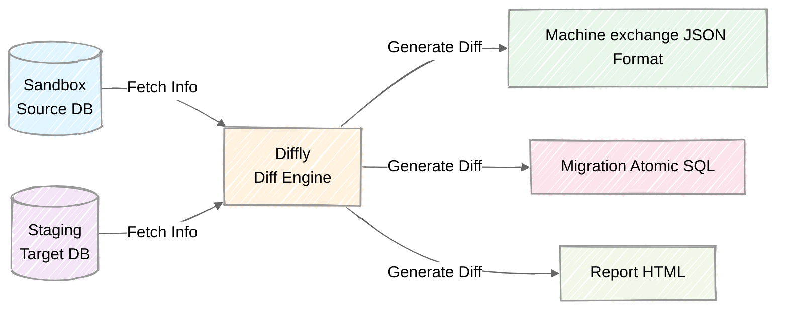

<div align="center">
	<a href="https://github.com/kodaskills/diffly">
	    
	</a>

<h1>Diffly</h1>
<h2>Quickly compare your SQL data with clarity and style.</h2>

[](https://docs.rs/diffly)
[](https://github.com/kodaskills/diffly/issues)
[](https://github.com/kodaskills/diffly/pulls)
[](https://opensource.org/licenses/MIT)
[](CODE_OF_CONDUCT.md)

</div>

<h3 align="center">
⭐ Like what we're doing? Give us a star ⬆️
</h3>

</div>

**Diffly** is a Rust CLI and library for generating row-level data diffs between SQL databases such as PostgreSQL, MySQL, MariaDB, and SQLite. It produces human-readable tables with color-coded inserts, updates, deletes, and totals, as well as machine-readable JSON output for CI/CD pipelines, automated testing, or reporting. Perfect for QA, migrations, ETL verification, or auditing database changes.

## 👤 Who is Diffly for?

Diffly is built for developers, data engineers, and teams who need to **trust their data**, not just their schema.

It is especially useful for:

- Backend and platform engineers validating database migrations  
- Data engineers verifying ETL and replication pipelines  
- QA teams performing data-level regression testing  
- DevOps teams automating checks in CI/CD  
- Auditors and compliance teams tracking record-level changes  

If your system moves or transforms data between databases, Diffly helps ensure nothing was lost, altered, or corrupted.

## ⏱️ When should you use Diffly?

Use Diffly whenever you need to answer:

- *Did my data change?*  
- *Which rows changed?*  
- *Were rows inserted, updated, or deleted?*  
- *Did my migration or sync behave as expected?*

Typical scenarios include:

- After running a migration script  
- After syncing or replicating data  
- Before deploying to production  
- After importing or transforming datasets  
- When debugging inconsistencies between environments  

Diffly compares **actual row data**, not SQL dumps or schemas, and reports differences in both **human-readable tables** and **machine-readable JSON**.

## 🎯 What problem does Diffly solve?

Most tools focus on:

- schema diffs  
- SQL files  
- structure  

But production issues usually come from:

- missing rows  
- wrong values  
- duplicated data  
- partial imports  

Diffly focuses on what really matters:  
**the data itself.**

It acts as a safety net between:

```
source database → transformation / migration → target database
```

by validating the result, not just the process.

## 🧭 Positioning

> Diffly is to databases what `git diff` is to source code — but for data, not schema.


## 🏛️ Architecture



## 🌿 Dialects

Today, **Diffly** is firstly focused, with big efforts, on Postgresql. We have started to implement other dialects where sometimes, for now, you could encounter some errors.  We'll fix them in future versions. Dialects are:

-  Postgresql ⭐
-  Mysql
-  MariaDB
-  Sqlite

Please feel free to fix or add new dialect by forking this repository and use a pull request, we ❤️ having feedbacks and [contributions](CODE_OF_CONDUCT.md)!

## ⚡ Quick Start

### 🐳 Run all once as cli in Docker

```bash
# Start PostgreSQL + fixtures import + diff execution
docker compose -f examples/postgresql/docker-compose.yml up --build

# Results are exported into the ./output/ root directory
ls ./output/
#  cs_20260211_*.json   ← Strucutred changeset
#  cs_20260211_*.sql    ← Atomic migration SQL (BEGIN/COMMIT)
#  cs_20260211_*.html   ← Visual report (open in a browser)

# To reset
docker compose -f examples/postgresql/docker-compose.yml down -v
```

### 📍 Run as cli in local (with cargo)

```bash
# 1. Run PostgreSQL alone if you do not have a local base (optional)
docker compose -f examples/postgresql/docker-compose.yml up postgres -d

# 2. Copy and paste postgresql config example and change the settings you need
# For example as is you must change host of 2 the sources to localhost (or your own)
cp ./examples/postgresql/config.toml ./my-config.toml

# 3. Build + run
cargo run --features cli -- --config ./my-config

# 4. Dry run (cli summary only, pas de fichiers)
cargo run --features cli -- --config ./my-config --dry-run

# 5. Only one format
cargo run --features cli -- --config ./my-config --format html #(or sql, or json)
```

### 📚 Run as library

```bash
# 1. Run PostgreSQL alone if you do not have a local base (optional)
docker compose -f examples/postgresql/docker-compose.yml up postgres -d

# 2. Copy and paste postgresql config example and change the settings you need
# For example as is you must change host of 2 the sources to localhost (or your own)
cp ./examples/postgresql/config.toml ./my-config.toml

# 3. Run
cargo run --example diff_as_lib -- ./my-config.toml
```

## 🔧 Base configuration (config.toml)

```toml
[source]
host = "localhost"
port = 5432
dbname = "diffly"
user = "diffly"
password = "diffly"
schema = "sandbox_admin1"    # Sandbox schema

[target]
host = "localhost"
port = 5432
dbname = "diffly"
user = "diffly"
password = "diffly"
schema = "staging"           # Target schema

[diff]
[[diff.tables]]
name = "pricing_rules"       # Table to compare
primary_key = ["id"]         # Simple PK

[[diff.tables]]
name = "tax_rules"
primary_key = ["region_code", "product_category"]  # Composite PK

[output]
dir = "./output"
```

**Note**: SQLite has no schema concept. Source and target must be **separate database files**. The `schema` config field is ignored.

## ➡️ Outputs

Actually **Diffly** generates 3 formats:

### JSON
Complete Changeset  with `before`/`after` for each modification, PK, modified columns, resume.

### SQL
Atomic transaction  `BEGIN`/`COMMIT` with `DELETE` → `UPDATE` → `INSERT` (secure order), useful for data migration.

The generated `.sql` diff file adapts to the target driver automatically:

| Driver | Identifier quoting | JSON literal |
|---|---|---|
| `postgres` | `"double_quotes"` | `'...'::jsonb` |
| `mysql` / `mariadb` | `` `backticks` `` | `'...'` |
| `sqlite` | `"double_quotes"` | `'...'` |


### HTML
Visual report with dark/light-mode made for humans.

We use [Sailfish](https://rust-sailfish.github.io/sailfish/) templating internally for better isolation. You can change the way the template engine works by modifying the `sailfish.toml` file on root directory if necessary  ([see configuration](https://rust-sailfish.github.io/sailfish/options/) for more informations).

## 🈂️ Examples

For more examples, visit our [examples repository](https://github.com/kodaskills/diffly/tree/main/examples).

## 🤝 Contribution

We welcome contributions! Please refer to the contribution guidelines (link needed if available). Join our [Github Discussions](https://github.com/kodaskills/diffly)  for questions and discussions.

## ♥️ Contributor Thanks

Big thanks to everyone who's been part of the **Diffly** journey, whether you've built a plugin, opened an issue, dropped a pull request, or just helped someone out on GitHub Discussions.

**Diffly** is a community effort, and it keeps getting better because of people like you.

<!---->

## 📄 License

Licensed under the MIT License, Copyright © 2026-present **Diffly**.
